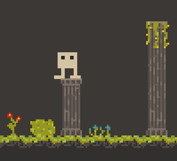

# sdfg

simple game...

"Why is it called sdfg?"
idk.

Everything is a work in progress.
All sprites designed by me!

example of what the game looks like:

## how to run

the game depends only on raylib, so you need to have that installed. I think it's written in raylib 5.0 but 4.x probably works too...

to run on linux:
``make && ./build/sdfg``

to run on windows:
idk figure it out on your own (i'll do it in the future)

## controls

W - jump
A - left
D - right

R - reset player position
F1 - debug mode
